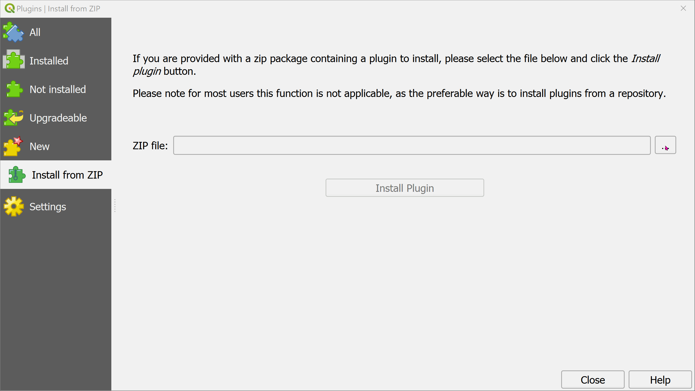

Installation instructions
=========================

Document below provides details of installing QGIS and FLO-2D plugin from Lutra repo.

QGIS
----

To install QGIS, we recommend using `OSGeo4W 64 bit installer <http://download.osgeo.org/osgeo4w/osgeo4w-setup-x86_64.exe>`_.

During installation, select **Advanced Install** > **Install from Internet** > **All Users** > Path to download > **Direct Connection** > The default available download website

A new window will appear to **Select Packages**. Select the following packages from the **Desktop** section:

- qgis: 3.x.x
- qgis-dev: 3.x.x
- qgis-ltr: 3.16.x

(Keep clicking on **Skip** until the latest version appears).

All the dependencies will be automatically selected.

For future update/upgrade, with a new release of QGIS, you can run the installer and the new packages will appear.

Installing FLO-2D plugin
------------------------

In QGIS, from the main menu, select **Plugins** > **Manage and Install Plugins **

From the left panel, select **From Zipped File**

**Browse** to the zipped Plugin file and load it.

Click **Install plugin**

To upgrade or switch to an older plugin, repeat the above.

